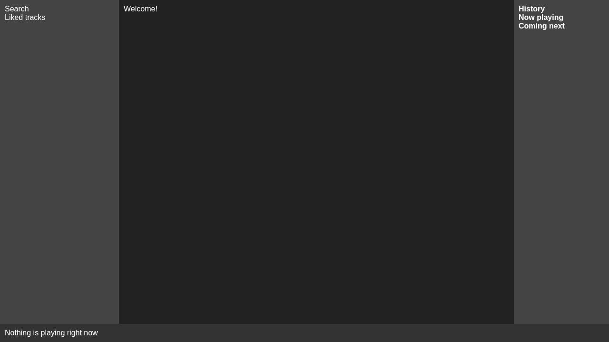
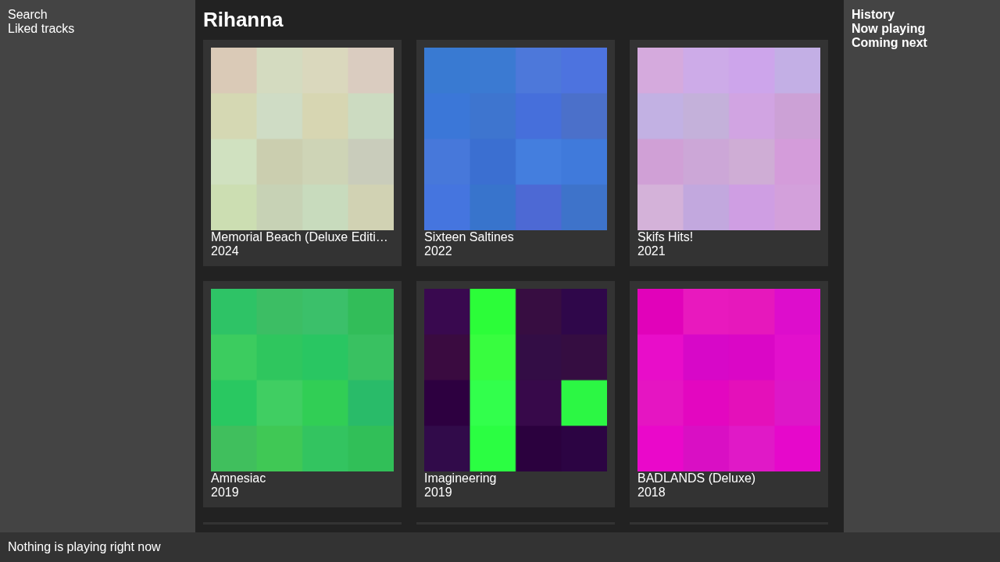
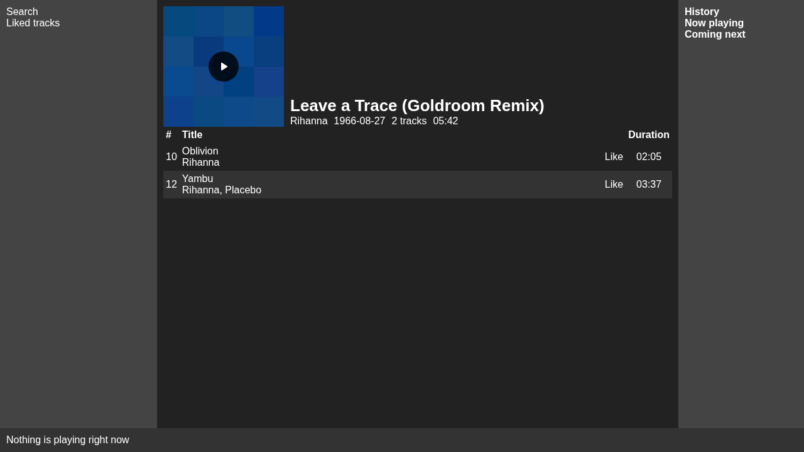
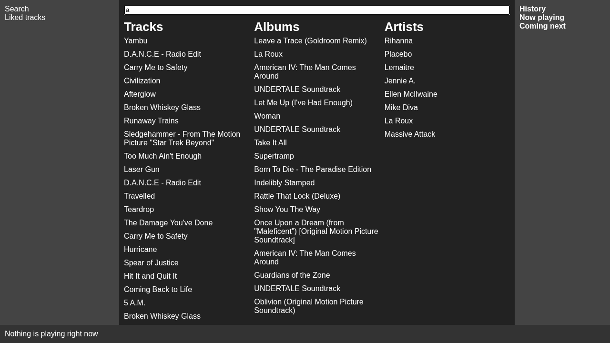
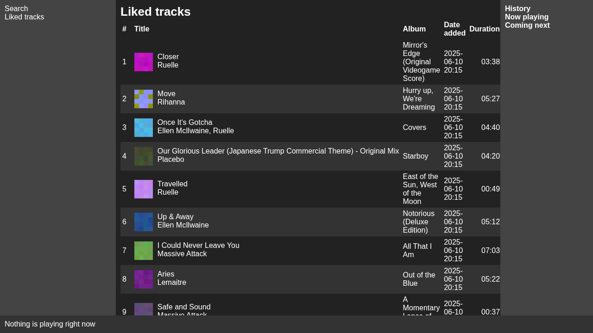

# Orkester (swedish for orchestra)

WIP Web based music player for local music

Built using Gofiber and Elm

# Installation

## Fedora

```bash
sudo dnf install mediainfo icu
```

| package      | intent                                                         |
| ------------ | -------------------------------------------------------------- |
| mediainfo    | used to get metadata from tracks                               |
| icu          | used to enable unicode handling of strings for SQLite database |
| libicu-devel | used to build the production version of Orkester               |

## Screenshot(s)

### Home page



### Artist page



### Album page



### Search page



### Liked tracks


